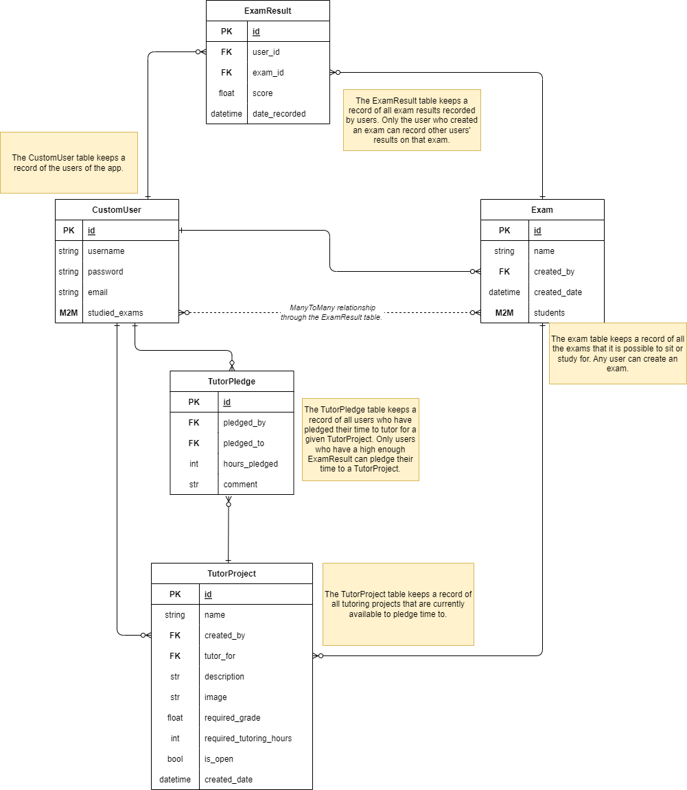

# Crowdfunding Back End

This is an example completed back-end for the She Codes Plus course content. It is intended for use in project feedback, to allow mentors to demonstrate techniques and code patterns to students, without needing to write a new app every time. 

It is NOT intended to be shared with students before their DRF projects are submitted, since it includes content they are expected to synthesise themselves.

The deployed back-end can be found here: https://example-finished-drf-project.fly.dev/

## App Name: "Examplify"
Examplify is a crowdfunding app that allows educators to connect students in their classes with tutors who have succeeded in the class previously. 

Educators advertise upcoming exams (i.e., projects) that they need tutors for. Ex-students can pledge their time to help current students study, as long as they achieved a high enough grade on that same exam in a previous class. Educators can specify the grade they require their tutors to have achieved on an exam in order to quality to tutor for it.

## Entity Relationship Diagram

### API Spec

| URL                          | HTTP Method | Purpose                                                                                                           | Request Body                                                                                                                                                                         | Success Response Code | Authentication/Authorisation                                                                                                  | Complete |
| ---------------------------- | ----------- | ----------------------------------------------------------------------------------------------------------------- | ------------------------------------------------------------------------------------------------------------------------------------------------------------------------------------ | --------------------- | ----------------------------------------------------------------------------------------------------------------------------- | -------- |
| `/`                          | GET         | Returns `hello world` to prevent the root URI from returning a 404.                                               | N/A                                                                                                                                                                                  | 200                   | None                                                                                                                          | ✅       |
| `/api-token-auth/`           | POST        | Obtain a JWT to use as authentication at other endpoints, as well as the details of the currently-logged-in user. | `{` `"username": ...,` `"password": ...` `}`                                                                                                                                | 200                   | Supply the correct username/password combo.                                                                                   |          |
| `/users/`                    | GET         | Query the list of all users.                                                                                      | N/A                                                                                                                                                                                  | 200                   | None                                                                                                                          |          |
| `/users/`                    | POST        | Create a new user account.                                                                                        | `{` `"username": ...,` `"email": ...,` `"password: ...` `}`                                                                                                              | 201                   | None                                                                                                                          |          |
| `/users/<int: pk>/`          | GET         | Retrieve the details of a specific user.                                                                          | N/A                                                                                                                                                                                  | 200                   | None                                                                                                                          |          |
| `/users/<int: pk>/`          | POST        | Record a specific user's result on an exam.                                                                       | `{` `"exam_id": ...` `"score": ...` `}`                                                                                                                                     | 201                   | Bearer token (prefix: `"Token "`)  Must be the creator of the exam.                                                        |          |
| `/tutor_projects/`           | GET         | Query the list of all projects                                                                                    | N/A                                                                                                                                                                                  | 200                   | None                                                                                                                          |          |
| `/tutor_projects/`           | POST        | Create a new project                                                                                              | `{` `"name": ...,` `"tutor_for": ...`  `"description": ...,` `"image": ...,` `"required_grade": ...,` `"required_tutoring_hours": ...,` `"is_open": ...` `}` | 201                   | Bearer token (prefix: `"Token "`)  Must be the creator of the associated exam.                                             |          |
| `/tutor_projects/<int: pk>/` | GET         | Retrieve the details of a specific project                                                                        | N/A                                                                                                                                                                                  | 200                   | None                                                                                                                          |          |
| `/tutor_projects/<int: pk>/` | PUT         | Update the details of a specific project                                                                          | Fields to be updated                                                                                                                                                                 | 200                   | Bearer token (prefix: `"Token "`. Must be the creator of the project.)                                                        |          |
| `/tutor_projects/<int: pk>/` | POST        | Create a new pledge to a specific project.                                                                        | `{` `"hours_pledged": ...,` `"comment": ...,` `}`                                                                                                                           | 201                   | Bearer token (prefix: `"Token "`)  Must have an ExamResult that matches the exam and required_grade for this TutorProject. |          |
| `/tutor_pledges/`            | GET         | Query the list of all pledges.                                                                                    | N/A                                                                                                                                                                                  | 200                   | None                                                                                                                          |          |
| `/tutor_pledges/<int: pk>/`  | PUT         | Update a specific pledge.                                                                                         | Fields to be updated.                                                                                                                                                                | 200                   | Bearer token (prefix: `"Token "`)  Must be the creator of the pledge.                                                      |          |
| `/tutor_pledges/<int: pk>/`  | DELETE      | Delete a specific pledge.                                                                                         | N/A                                                                                                                                                                                  | 204                   | Bearer token (prefix: `"Token "`)  Must either be the creator of the pledge, or the creator of the TutorProject            |          |
| `/exams/`                    | GET         | Get the list of all exams it is possible to sit or study for.                                                     | N/A                                                                                                                                                                                  | 200                   | N/A                                                                                                                           |          |
| `/exams/`                    | POST        | Record a new exam.                                                                                                | `{` `"name": ...` `}`                                                                                                                                                          | 201                   | Bearer token (prefix: `"Token "`)                                                                                             |          |

> Notice how not every model in the ERD has an endpoint? That's not because we're showcasing perfect design - it's because we're showcasing a ruthlessly sparse MVP! 
> 
> Perhaps a later iteration of this app would have a full set of CRUD endpoints for every model, but the goal of this module was to move fast and break stuff :) 